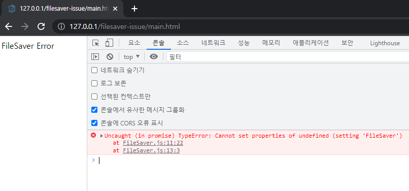

# FileSaver cannot work when dynamic import

* Used version : [v2.0.4](https://github.com/eligrey/FileSaver.js/releases/tag/v2.0.4)
* Environment : Apache2 + Php (It's just for test environment, it may cause all environment.)


## What's wrong?
It gets error when import `FileSaver` dynamically
```javascript
(async() => {
    const FileSaverSrc = "./FileSaver.js";
    const FileSaverLib = await import(FileSaverSrc);
    var blob = new Blob(["Hello, world!"], { type: "text/plain;charset=utf-8" });
    saveAs(blob, "hello world.txt");
})();
```




## How to fix it?
Just remove or make comment 11st line.

```javascript
(function (global, factory) {
  if (typeof define === "function" && define.amd) {
    define([], factory);
  } else if (typeof exports !== "undefined") {
    factory();
  } else {
    var mod = {
      exports: {}
    };
    factory();
    // global.FileSaver = mod.exports; <- remove this line !!
  }
})(this, function () {
```

